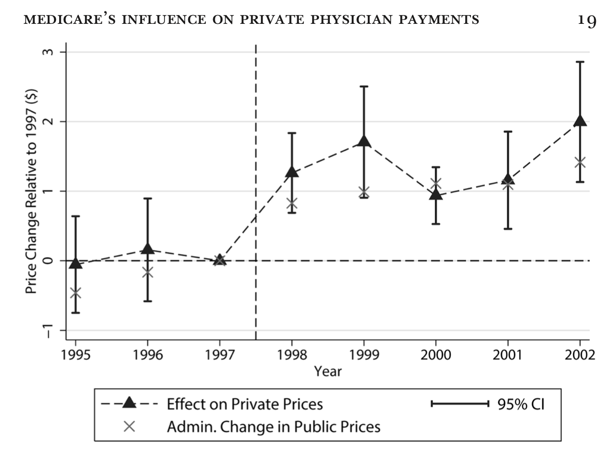
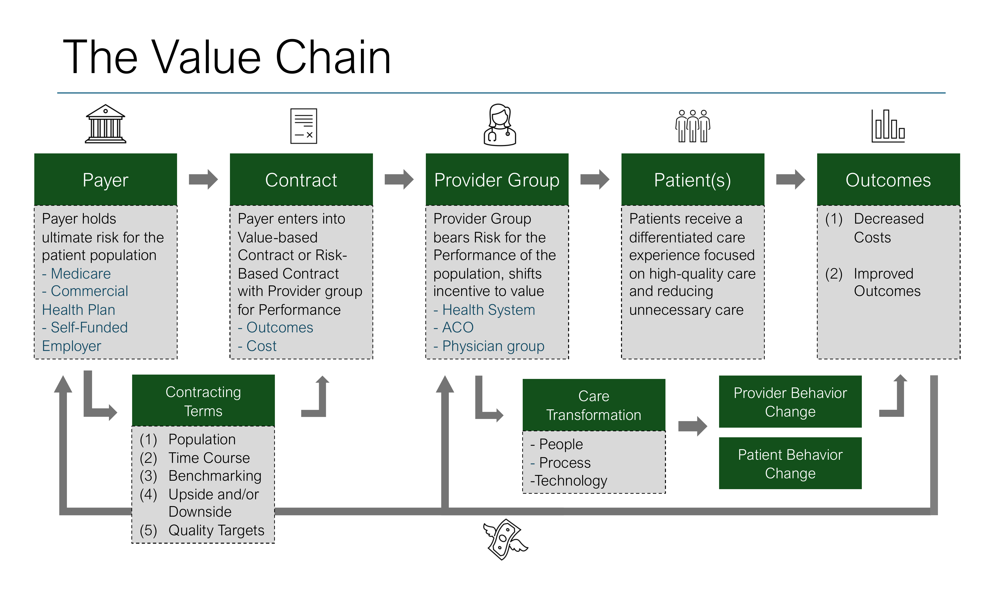

<!---------------------------------------------
  DISCLOSURES
----------------------------------------------->

## Disclosures {style="font-size: 30px;"}

<br>

::: {style="font-size: 0.95em;"}

| Relationship | Entity |
|:---|:---|
| Spouse — Employment | Aledade, Inc. (a primary care accountable care organization) |
| Other commercial interests | **None** |

:::

<br>

::: {style="color: #777; font-size: 0.9em;"}
The content of this presentation reflects the speaker's independent academic analysis. No commercial entity has reviewed, edited, or approved any portion of the material.
:::

::: {.notes}
Standard physician disclosure. Spouse's employment at Aledade is the only relevant relationship — disclose because Aledade is a primary care ACO enabler, and the talk discusses ACOs and value-based care arrangements (Part 2). I have no consulting, equity, speakers bureau, honoraria, or research support relationships with any commercial entity in healthcare. The analysis in this talk is independent.
:::


<!---------------------------------------------
  PART 1: THE CHASSIS
----------------------------------------------->

# Part 1: The Chassis {background-color="#1C1C1C" style="text-align: center; color: #CFAE70;"}

::: {style="text-align: center; color: #999; font-size: 1.0em; margin-top: 30px;"}
The same payment architecture runs through every U.S. health-care dollar.
:::


## {background-color="#F5F3EF"}

::: {.notes}
Pose the question and pause. Let the room vote — U.S., Canada, Germany, or other? Most physicians will guess U.S., because the chassis they live with sounds exactly like this. Don't reveal yet.
:::

::: {style="text-align: center; margin-top: 60px;"}

::: {.fragment style="font-size: 1.6em; font-weight: 600; color: #1C1C1C; line-height: 1.3;"}
A high-income country pays outpatient physicians **fee-for-service** off a national fee schedule.
:::

<br>

::: {.fragment style="font-size: 1.6em; font-weight: 600; color: #1C1C1C; line-height: 1.3;"}
Hospitals are paid **per case via DRGs**.
:::

<br>

::: {.fragment style="font-size: 1.6em; font-weight: 600; color: #1C1C1C; line-height: 1.3;"}
**Private insurers** compete for patients.
:::

<br><br>

::: {.fragment style="font-size: 1.2em; color: #946E24; font-style: italic;"}
Which country?
:::

:::


## It's Germany — same chassis, very different cost {style="font-size: 30px;"}

::: {.notes}
Reveal. Germany's payment chassis is structurally identical to U.S. Medicare on the surface — outpatient FFS, inpatient DRGs. But the outpatient FFS sits inside a regional global budget: sickness funds pay each regional physician association (KV) a fixed annual sum, and the KV distributes payment via floating point values. If total volume exceeds budget, point values get retroactively reduced. Yet Germany spends roughly two-thirds of what we do per capita. The chassis isn't what makes the U.S. expensive.

The U.S./Germany comparison is not a fringe critique — it was the lifework of Uwe Reinhardt, the German-born Princeton economist who spent forty years pointing out that other countries (Germany above all) achieved universal coverage and cost control using payment tools structurally similar to ours. *Priced Out* (2019) is the book-length statement of the argument we are making in this talk. Reinhardt's central observation: Americans pay roughly twice what Germans pay, while consuming fewer services. The difference is not the chassis.
:::

<br>

::: {.fragment style="text-align: center; font-size: 1.15em; line-height: 1.6;"}
Outpatient is FFS off the **EBM** schedule.

Inpatient via **G-DRGs**.
:::

<br>

::: {.fragment style="text-align: center; font-size: 1.4em;"}
**~$9,400** per capita

vs.

**~$13,500** in the U.S.
:::

<br>

::: {.fragment style="text-align: center; color: #777; font-size: 0.95em;"}
The chassis is the same. The structures *around* the chassis are not.
:::

::: {.fragment .aside data-fragment-index="0"}
EBM = *Einheitlicher Bewertungsmaßstab* (Uniform Value Scale) — Germany's national outpatient fee schedule
:::

::: {style="font-size: 0.45em; text-align: center; color: #888;"}
Source: OECD Health at a Glance, 2023.
:::


## US vs. Germany {style="font-size: 28px;"}

<br>

::: {style="font-size: 0.9em;"}

<table style="width: 100%; border-collapse: collapse;">
<thead>
<tr>
<th style="text-align: left; width: 24%; padding: 8px;"></th>
<th style="text-align: left; width: 38%; padding: 8px;">U.S.</th>
<th class="fragment" data-fragment-index="1" style="text-align: left; width: 38%; padding: 8px;">Germany</th>
</tr>
</thead>
<tbody>
<tr style="background-color: #F5F3EF;">
<td style="padding: 8px;"><strong>Risk pooling</strong></td>
<td style="padding: 8px;">Fragmented</td>
<td class="fragment" data-fragment-index="1" style="padding: 8px;">Universal via ~95 sickness funds</td>
</tr>
<tr>
<td style="padding: 8px;"><strong>Benefits package</strong></td>
<td style="padding: 8px;">Vary by plan, employer, year</td>
<td class="fragment" data-fragment-index="1" style="padding: 8px;">Single nationally defined package</td>
</tr>
<tr style="background-color: #F5F3EF;">
<td style="padding: 8px;"><strong>Payment rates</strong></td>
<td style="padding: 8px;">Bilaterally negotiated in a quasi-market</td>
<td class="fragment" data-fragment-index="1" style="padding: 8px;">Collectively negotiated; applied uniformly</td>
</tr>
<tr>
<td style="padding: 8px;"><strong>Aggregate spending control</strong></td>
<td style="padding: 8px;">None</td>
<td class="fragment" data-fragment-index="1" style="padding: 8px;">Regional outpatient budgets; KHVVG hospital reform (2025)</td>
</tr>
</tbody>
</table>

:::

::: {.notes}
Four guardrails Germany has and the U.S. doesn't. The third row is the one most often misread: we DO have collective national price-setting — Medicare's RVU/DRG system. The difference is that in Germany the schedule IS the price; every sickness fund pays the same EBM points at the same point value. In the U.S., the schedule is the floor, and every commercial payer-provider pair negotiates a multiplier on top of it. Consolidation is what pushes that multiplier higher. Sources: Commonwealth Fund Germany Profile; CBO (2022); European Observatory KHVVG Analysis.

On the "Aggregate spending control" row — be ready for pushback from physicians who live with budget neutrality. The honest framing: the U.S. has *segment-internal* spending controls — RVU budget neutrality (when one service's RVUs go up, others adjust so Medicare physician spending doesn't grow due to revaluation alone), MACRA-capped conversion factor updates, IPPS productivity adjustments, MA benchmark caps, and the IRA Part D negotiation. Each is real. But every one of them constrains a *slice* of the system — Medicare physicians, Medicare hospitals, MA — while commercial spending, where the multiplier lives, is unconstrained. So providers can (and do) shift volume and intensity into commercial-priced settings, and the system-wide spending growth continues. Germany's guardrail is whole-system: regional outpatient budgets bind every fund and every physician simultaneously, and the KHVVG hospital reform (phasing 2025–2029) does the same on the inpatient side. The cell says "None" as shorthand for "no system-wide brake" — say "no brake that crosses payer lines" if the room is technical.

Reinhardt would frame this slide as the visible surface of a deeper, moral question. In *Priced Out* (2019), he writes that "our arguments always have been, are now, and will continue forever to be over the elephant in the room no one likes to mention, namely, the fundamental question, *to what extent we should be our poor and sick brothers' and sisters' keeper in health care*." Germany's five guardrails are downstream of having answered that question — a settled social contract that the U.S. has never reached. The structural absences on the right column are the operational expression of an unsettled moral debate on the left.
:::


## One in three U.S. health-care dollars is administrative {style="font-size: 28px;"}

<br>

:::: {.columns}

::: {.column width="50%"}
::: {style="text-align: center;"}

::: {style="font-size: 2.5em; font-weight: 700; color: #946E24;"}
$2,500
:::

::: {style="font-size: 1.0em; color: #1C1C1C;"}
per capita on admin in the U.S.
:::
:::
:::

::: {.column width="50%"}
::: {style="text-align: center;"}

::: {style="font-size: 2.5em; font-weight: 700; color: #1C1C1C;"}
$550
:::

::: {style="font-size: 1.0em; color: #1C1C1C;"}
per capita in Canada
:::
:::
:::

::::

<br>

::: {style="text-align: center; font-size: 1.05em; color: #1C1C1C;"}
Per-physician admin cost is **~4× higher** than Canada's.

Practice spending on prior-auth staffing rose **43%** from 2019 to 2024.
:::

::: {style="font-size: 0.45em; text-align: center; color: #888;"}
Sources: Cutler, Brookings (2020); Himmelstein, Campbell, Woolhandler, *Annals of Internal Medicine* (2020); MGMA (2024).
:::

::: {.notes}
Cutler estimates 25–33% of U.S. spending is administrative. Each U.S.-side guardrail absence on the prior slide produces a separate stream of admin work — credentialing × N payers, coverage determinations and prior auth, contract negotiation and denials, deductible tracking and collections. Cutler estimates ~$50B/year in achievable savings from streamlining alone. This is where the room nods.

Reinhardt's framing of the same data: in *Priced Out*, he describes American patients as "blindfolded shoppers in department stores searching helplessly for what they need" — purchasing through "myriad insurance schemes" that vary by employer, age, and demographics. He puts the per-physician fragmentation cost at ~$80,000/year (vs. ~$22,000 in Canada) — essentially the same number Himmelstein replicated in 2020. Reinhardt's deeper claim: the administrative overhead is not a bug. It is the operational footprint of the U.S. choice to run thousands of bilateral negotiations instead of one collective one.

A line worth landing from the podium: *"American healthcare is expensive because we have built an enormous industry to negotiate the price of fee-for-service and design artisanal benefit packages, another industry to submit the bills, and a still larger industry to deny the bills that result."*
:::


## Medicare prices ~10,000 services with one formula {style="font-size: 30px;"}

<br>

::: {style="text-align: center; font-size: 1.1em; line-height: 1.4;"}

Payment  =  [
[Work]{style="font-weight: 600;"}  +  [Practice Expense]{style="font-weight: 600;"}  +  [Malpractice]{style="font-weight: 600;"}
]{style="border-bottom: 3px solid #946E24; padding-bottom: 6px;"}  ×  [Conversion Factor]{style="font-weight: 600;"}

[Relative Value Units (RVUs)]{style="font-size: 0.7em; color: #946E24; font-style: italic;"}

:::

. . .

<br>

A committee of physicians (the **RUC**) recommends the relative weights. CMS accepts **~90%**.

. . .

It is **zero-sum** by design — every specialty competes for a slice of a fixed pie.

::: {.aside}
RUC = Relative Value Scale Update Committee · CMS = Centers for Medicare & Medicaid Services
:::

::: {.notes}
The point isn't the formula — it's that there is one. The RUC's recommendations get ~90% adoption, so a small group sets relative values for the entire industry. Budget neutrality means one specialty's gain is another's loss.
:::


## Total spending is payment (P) times quantity (Q) {style="font-size: 24px;"}

::: {.notes}
This is the operational answer to the "but we have budget neutrality" pushback.

Spending is the accounting identity P × Q. We can decompose P further: in the U.S., what providers actually receive is the Medicare fee schedule price times a commercial multiplier — $P = P^{CMS} \times M$. So total spending decomposes into $P^{CMS} \times M \times Q$.

Budget neutrality acts on $P^{CMS}$ — and only on its *relative* values across services, not on its overall level. When CMS adds or revalues RVUs, the conversion factor adjusts so the change is revenue-neutral *within Medicare physician spending*. It is zero-sum across specialties. It is not zero-sum across volume. Aggregate Medicare spending grows whenever Q grows, which it always does.

$M$ is bilaterally negotiated commercial pricing on top of the Medicare schedule. Nothing constrains it. Consolidation pushes it up.

$Q$ is volume. Nothing constrains it at the system level. FFS incentives push it up.

So when we said earlier that the U.S. has "no system-wide brake on aggregate spending" — this is what that means operationally. We have a partial brake on the relative shape of one of three terms. Germany's regional outpatient budget caps $P \times Q$ together by floating the point value as Q grows.
:::

<br>

```{=html}
<video id="pq-decomp-video"
       src="media/videos/anim_pq_decomposition/1080p60/PQDecomposition.mp4"
       style="width:100%; height:auto; max-height:70vh; object-fit:contain; display:block; margin: 0 auto;"
       muted
       playsinline
       disablepictureinpicture
       disableremoteplayback
       controlslist="nodownload nofullscreen noremoteplayback noplaybackrate"></video>
<span class="fragment" style="display: block; height: 0; margin: 0; padding: 0;"></span>
```

```{=html}
<script>
(function () {
  // sections/PQDecomposition.json — 2 sections (load + 1 click).
  // load: Spending = P × Q (~2s)
  // click 1: P distributes into P^Medicare × M (~3s, ending at ~5s)
  const pausePoints = [2.0, 5.0];
  let currentPause = 0;

  function init() {
    const video = document.getElementById('pq-decomp-video');
    if (!video) return;
    const ownSlide = video.closest('section');

    video.currentTime = 0;
    const playPromise = video.play();
    if (playPromise && typeof playPromise.catch === 'function') {
      playPromise.catch(function () {});
    }

    video.addEventListener('timeupdate', function () {
      if (currentPause < pausePoints.length &&
          video.currentTime >= pausePoints[currentPause]) {
        video.pause();
      }
    });

    function onFragmentShown(event) {
      var frag = event && event.fragment;
      if (!frag) return;
      var fragSlide = frag.closest('section');
      if (fragSlide !== ownSlide) return;
      if (currentPause < pausePoints.length - 1) {
        currentPause++;
        video.play();
      }
    }

    function bindReveal() {
      if (typeof Reveal === 'undefined' || typeof Reveal.on !== 'function') {
        setTimeout(bindReveal, 50);
        return;
      }
      Reveal.on('fragmentshown', onFragmentShown);
    }
    bindReveal();
  }

  if (document.readyState === 'loading') {
    document.addEventListener('DOMContentLoaded', init);
  } else {
    init();
  }
})();
</script>
```


## Commercial contracts don't negotiate thousands of prices — they negotiate multipliers {style="font-size: 24px;"}

::: {.notes}
The ~75% figure comes from analysis of Texas Blue Cross claims data. The remaining 25% is where insurers customize — mainly adjusting capital-intensive services (imaging) down and labor-intensive services (E&M visits) up relative to Medicare's averages.

Key nuance: although many commercial contracts start with a single Medicare multiplier, insurers routinely negotiate tiered adjustments for specific service categories.

The insight is that even the exceptions are usually *defined relative to Medicare*. The chassis still sets the reference point.
:::

<br>

::: {style="text-align: center; font-size: 1.05em; line-height: 1.4;"}

Medicare Payment  =  RVUs  ×  **$33.89**

Commercial Payment  =  RVUs  ×  **$33.89  ×  1.8**

:::

. . .

**~75%** of all commercial services are directly benchmarked to Medicare's relative values.

. . .

Contracts often use **tiered multipliers** by service type — e.g., E/M at 130%, procedures at 170% of Medicare.

::: {.aside}
E/M = evaluation and management (office visits, consultations)
:::


## The chassis isn't just scaffolding — it's a sounding board {style="font-size: 26px;"}

::: {.notes}
Every private contract built on that benchmark acts like a soundboard, making Medicare's signal louder in the private sphere.

When Medicare gets something wrong — misprices a service, creates a perverse threshold — the error gets amplified across the entire economy. The 1998 surgical bonus elimination shifted medical school specialty choices by 5.5 percentage points, because the private market amplified the signal.

"So that's the chassis — and now you understand it's not a passive frame, it's a live signal. Every incentive Medicare builds into the system echoes through the whole economy. With that in mind, let's look at what the engine actually produces."
:::

<br>

Because ~75% of commercial contracts are pegged to Medicare, any change Medicare makes **amplifies and reverberates through the entire health-care economy**.

. . .

::: {style="font-size: 1.15em; text-align: center;"}
A **$1** change in the Medicare fee schedule

becomes a **$1.16** change in private payments.
:::

. . .

Medicare serves as a **reference system** that bilateral market negotiations orbit around.

::: {style="font-size: 0.45em; text-align: center; color: #888;"}
Source: Clemens & Gottlieb, "In the Shadow of a Giant," *Journal of Political Economy* (2017).
:::


## The chassis is the same. The multiplier is what diverges. {style="font-size: 26px;"}

<br>

::: {style="text-align: center; font-size: 1.1em; line-height: 1.8;"}

Medicare:    RVUs × $33.89 × **[1.0]{style="color: #946E24;"}**

U.S. commercial:    RVUs × $33.89 × **[1.8]{style="color: #C03;"}**  *(bilaterally negotiated)*

:::

<br>

::: {style="font-size: 1.05em; text-align: center; color: #777;"}
We have collective national price-setting. We just don't enforce it as the actual price.
:::

::: {.notes}
We DO have collective national price-setting — that's exactly what Medicare's RVU/DRG schedule is. The difference between the U.S. and Germany isn't the schedule. It's what we let happen on top of it. In Germany, the schedule IS the price; the multiplier is 1.0 across every payer. In the U.S., the schedule is the floor, and every commercial payer-provider pair negotiates a multiplier on top of it — averaging 1.8 (CBO 2022 puts hospital services at 2.23×, outpatient 2.40×, inpatient 1.82×). About 75% of commercial services are directly benchmarked to Medicare's relative values. Consolidation is the lever that pushes that multiplier higher.

If the room asks how Germany does it, the analogous formula is: *EBM points × regional point value × 1.0* — the same chassis priced uniformly across all ~95 sickness funds because there is one collective buyer per region.

This is exactly Reinhardt's "fragmented buyer" thesis. In *Priced Out* and across his Health Affairs work, he attributed U.S. price levels not to the payment chassis but to the absence of unified purchasing — "myriad insurance schemes" instead of "uniform fee schedules and rules." The multiplier on this slide is the operational form of that fragmentation.
:::


## Commercial pays well above Medicare — varying by service type {style="font-size: 24px;"}

::: {.notes}
This slide gives the empirical anchor for the "1.8" on the prior slide. The multiplier isn't one number — it's a tier, varying by service type, but always above 1.0. Hospital outpatient is the highest premium (240%) because of consolidation in the hospital outpatient department market — many services that used to happen in physician offices now happen in HOPDs at the higher rate. Inpatient (182%) is closer to Medicare because there's more direct competition and DRG pricing is harder to mark up. Physician services (129%) are the closest to Medicare — physicians have the least negotiating leverage. The tiered structure is the operational form of differential market power across segments. Source: CBO (2022).
:::

<br>

::: {style="font-size: 1.0em;"}

| Service type | Commercial as % of Medicare |
|:---|:---:|
| Hospital services (combined) | **223%** |
| Hospital outpatient | 240% |
| Hospital inpatient | 182% |
| Physician services | 129% |

:::

<br>

::: {style="font-size: 0.45em; text-align: center; color: #888;"}
Source: Congressional Budget Office (2022).
:::


## A $1 Medicare cut becomes a $1.16 private cut {style="font-size: 30px;"}

<br>

{fig-align="center" width="55%"}

::: {style="font-size: 0.45em; text-align: center; color: #888;"}
Source: Clemens & Gottlieb, "In the Shadow of a Giant," *Journal of Political Economy* (2017).
:::

::: {.notes}
When Medicare changes a price, the change amplifies in private contracts because of the multipliers. So every flaw, bias, and incentive baked into Medicare's architecture gets transmitted across the system. Private prices follow Medicare *down*, not up. The takeaway lands on the next slide.
:::


## {background-color="#1C1C1C"}

::: {style="text-align: center; margin-top: 80px; max-width: 900px; margin-left: auto; margin-right: auto;"}

::: {style="border-left: 4px solid #CFAE70; padding: 30px 40px; background-color: rgba(148, 110, 36, 0.1);"}

::: {style="font-size: 1.5em; color: #E0D5C0; line-height: 1.6;"}
The chassis is a **sounding board** — Medicare's signal echoes through every multiplier.
:::

:::

:::

::: {.notes}
The key point. Whatever Medicare prices — well or poorly — gets transmitted, with amplification, across the entire payment ecosystem because of the multipliers built on top of it. This is why getting Medicare's relative values right matters so much. And it's why budget-neutrality games at the RUC have economy-wide consequences. The chassis is not a quiet platform; it broadcasts.
:::


## FFS rewards volume — but volume isn't where U.S. cost comes from {style="font-size: 24px;"}

<br>

::: {style="font-size: 1.0em;"}

|  | U.S. | Germany | OECD avg. |
|:---|:---:|:---:|:---:|
| Doctor visits / capita | 4.0 | **9.9** | 6.8 |
| Hospital beds / 1,000 | 2.8 | **7.8** | 4.3 |
| Average length of stay (days) | 5.4 | **8.9** | 6.7 |

:::

<br>

::: {style="font-size: 1.05em; text-align: center;"}
The FFS volume incentive is real. Germany has it too.
:::

::: {style="font-size: 0.45em; text-align: center; color: #888;"}
Sources: OECD Health Statistics; Anderson, Reinhardt et al., *Health Affairs* (2003).
:::

::: {.notes}
"It's the prices, stupid." — Anderson, Reinhardt et al., Health Affairs (2003). Two decades old, still the cleanest summary. Engage the audience's existing mental model directly: yes, FFS rewards volume — but if that were the dominant explanation for U.S. cost, Germany (with the same FFS chassis) would also be high-cost. It isn't. Germans see the doctor MORE than we do, have MORE beds, stay LONGER. Aggregate volume in Germany is higher; spending is lower. So FFS volume incentives are necessary but not sufficient. The U.S. premium is in price per unit and in the administrative tax stacked on top of those units.

Reinhardt's exact framing in *Priced Out*: Americans pay roughly twice what Germans pay for healthcare while consuming fewer services. He titled the book around this asymmetry — the "priced out" is the working- and middle-class American who can no longer afford the system, not the patient who consumes too much of it.
:::


## Consolidation pushes the multiplier up {style="font-size: 26px;"}

<br>

:::: {.columns}

::: {.column width="50%"}

::: {style="font-size: 1.2em;"}
**1,331** hospital mergers since 2000

**69%** of hospitals now in systems

Physician employment: **28% → 47%**
<span style="font-size: 0.7em; color: #777;">(2008–2016)</span>
:::

:::

::: {.column width="50%"}

::: {style="font-size: 1.05em; margin-top: 20px;"}
CBO: **zero association** between commercial physician prices and quality.
:::

:::

::::

::: {style="font-size: 0.45em; text-align: center; color: #888;"}
Source: Gaynor, "Three Points About Consolidation in Health Care Markets" (2025); CBO (2022).
:::

::: {.notes}
The cost-shifting story — "Medicare underpays so we charge commercial more" — is intuitive but doesn't survive the data. Profit-maximizing firms don't sit on unused market power. The real driver is leverage from horizontal and vertical consolidation. Network adequacy means insurers must include dominant systems, so the insurer's only weapon — exclusion — is gone. The Germany tie-in is critical: in their system, consolidation can't move multipliers because there is no multiplier above the schedule. Consolidation in the U.S. IS multiplier leverage. That's the whole game.

Reinhardt has a useful aphorism for why consolidation, once it has occurred, is so politically difficult to unwind: *"every dollar of health spending equals someone's health-care income."* The multiplier above the schedule isn't an accounting artifact — it is the income of consolidated systems, employed physicians, private equity portfolios, and downstream service lines. Reform pressure that reduces the multiplier is reform pressure that reduces somebody's paycheck. That is the political topology, and it is why the levers in Part 3 (site-neutral payment, antitrust, all-payer rate setting) move slowly even when the evidence is clear.
:::


<!---------------------------------------------
  PART 2: WHAT WE'VE TRIED IN PLACE OF THE GUARDRAILS
----------------------------------------------->

# Part 2: The Fix {background-color="#1C1C1C" style="text-align: center; color: #CFAE70;"}


## {background-color="#1C1C1C"}

::: {style="text-align: center; margin-top: 80px; max-width: 900px; margin-left: auto; margin-right: auto;"}

::: {style="border-left: 4px solid #CFAE70; padding: 30px 40px; background-color: rgba(148, 110, 36, 0.1);"}

::: {style="font-size: 1.5em; color: #E0D5C0; line-height: 1.6;"}
Cost-sharing provides **volume control**, not **value control**.
:::

:::

:::

::: {.notes}
Set up the cost-sharing block as a key lesson before the data. HDHPs and patient cost-sharing successfully depress utilization, but they do not select for value. The next two slides walk through the evidence — Brot-Goldberg (indiscriminate cutting) and Chandra-Flack-Obermeyer (lethal consequences for the highest-risk patients).
:::


## Cost-sharing provides volume control, not value control {style="font-size: 26px;"}

::: {.notes}
This is the demand-side counterpart to the supply-side FFS machine. The FFS engine incentivizes volume on the supply side. Cost-sharing is the system's main tool for controlling volume on the demand side. Does it work?

The Brot-Goldberg paper is the cleanest evidence we have. They studied a large firm that moved all employees from free healthcare (no cost-sharing at all) to a high-deductible plan. Key findings:

1. People reduced spending by about 12-15% in year one — so yes, cost-sharing does depress volume.
2. But they did NOT become better shoppers. They didn't switch to cheaper providers. They didn't compare prices. They just consumed less of everything.
3. The reduction was indiscriminate — necessary and unnecessary care dropped equally.
4. The effects were concentrated among lower-income employees, raising equity concerns.

Setup for the next slide: Brot-Goldberg shows cost-sharing is a blunt instrument — patients cut everything indiscriminately. But does it actually hurt them? Chandra, Flack & Obermeyer answer: yes, people die.
:::

<br>

The standard response to rising costs: make consumers pay more, and they'll shop smarter.

HDHP enrollment surged from **13% to 33%** of the privately insured population (2010–2025). Utilization dropped **~15%**.

. . .

But researchers studied what actually happens when a large employer switched to a high-deductible plan:

- Spending fell **immediately** — but patients cut **all** care indiscriminately
- They did not price-shop. They did not distinguish necessary from unnecessary care
- The savings came almost entirely from **avoiding care**, not from finding better prices
- Low-income employees reduced spending the most — including **high-value preventive care**

::: {style="font-size: 0.45em; text-align: center; color: #888;"}
Source: Brot-Goldberg et al., "What Does a Deductible Do?", *Quarterly Journal of Economics* (2017).
:::

::: {.aside}
HDHP = high-deductible health plan
:::


## A blunt instrument can have lethal side effects {style="font-size: 28px;"}

::: {.notes}
The one-two punch with Brot-Goldberg. That paper showed cost-sharing is a blunt instrument. This paper shows the consequence: people die.

The research design: Medicare Part D gives every new 65-year-old the same annual drug budget, but enrollment month varies by birth month. A February enrollee has been spending down her budget for months by December; a September enrollee has barely touched hers. Same people, same drugs, same health — different out-of-pocket prices driven purely by calendar timing.

Key details:
- The effect is concentrated in "middle spenders" — people whose drug spending puts them on track to hit the donut hole.
- High-risk patients (identified via ML prediction models) cut back MORE on exactly the drugs that would benefit them most. Opposite of what a rational consumer model predicts.
- Patients are largely unaware: 53% predict no negative health consequences from missing drugs for a week.
- At $11,321 per life-year, these are extraordinarily cheap lives to save. Standard threshold for cost-effective interventions: $50,000–$100,000 per life-year.
:::

<br>

Medicare Part D's "donut hole" randomly assigns different drug budgets based on birth month. Chandra, Flack & Obermeyer traced what happens next:

. . .

- A **$100/month** decrease in drug budget → **13.9% increase in mortality**
- Patients stop taking **statins, blood pressure meds, diabetes drugs** — the high-value ones
- The sickest patients — those most likely to have a heart attack — **cut back the most**
- Only **one-third** of patients believe missing their drugs for a month could have serious consequences

. . .

::: {style="font-size: 1.15em;"}
The cost to save these lives? **$11,321 per life-year.**
:::

::: {style="font-size: 0.45em; text-align: center; color: #888;"}
Source: Chandra, Flack & Obermeyer, "The Health Costs of Cost Sharing," *Quarterly Journal of Economics* (2024).
:::


## {background-color="#1C1C1C"}

::: {style="text-align: center; margin-top: 80px; max-width: 900px; margin-left: auto; margin-right: auto;"}

::: {style="border-left: 4px solid #CFAE70; padding: 30px 40px; background-color: rgba(148, 110, 36, 0.1);"}

::: {style="font-size: 1.5em; color: #E0D5C0; line-height: 1.6;"}
What about just **showing consumers the prices**?
:::

:::

:::

::: {.notes}
Open the price-transparency block with the question. The Hospital Price Transparency Rule (2021) and Transparency in Coverage Rule (2022–2024) bet that publishing negotiated rates would let consumers shop their way to lower prices. Five years in, the verdict is in. The next three slides walk it: low awareness and low effect on patients; supply-side backfire; the architecture-change exception that actually works.
:::


## What about just showing consumers the prices? {style="font-size: 28px;"}

::: {.notes}
The Hospital Price Transparency Rule (effective Jan 2021) requires hospitals to publish machine-readable files with all negotiated rates, plus consumer-friendly displays for 300+ shoppable services. The Transparency in Coverage Rule (phased 2022–2024) requires insurers to publish negotiated rates and offer price comparison tools.

Five years in, roughly 46% of hospitals still aren't fully compliant (HHS OIG, Nov 2024). CMS has fined only 27 hospitals, totaling about $2 million — average hospital revenue is $270 million.

The Cooper MRI finding is devastating for the consumer-shopping model: MRIs are about as "shoppable" as healthcare gets — plannable, undifferentiated, widely available, significant out-of-pocket cost. And yet physician referral patterns explain 52% of price variance, while patient cost-sharing explains less than 1%. If transparency can't move the needle on MRIs, what hope does it have for complex inpatient care?
:::


<br>

Since 2021, hospitals must publish negotiated prices for every service. Since 2023, insurers must offer online price comparison tools.

. . .

But **only 9%** of Americans even know the data exists. When California offered state employees a transparency tool, **only 12%** used it.

. . .

And when patients *do* have prices, it doesn't matter much. Patients bypass an average of **6 cheaper MRI providers** on the way to their appointment — because their doctor told them where to go.

::: {style="color: #777; margin-top: 15px;"}
Physician referral explains **52×** more price variance than patient cost-sharing.
:::

::: {style="font-size: 0.45em; text-align: center; color: #888;"}
Sources: KFF Health Tracking Poll; Desai et al., *Health Affairs* (2017); Chernew, Cooper et al., *Journal of Health Economics* (2021).
:::


## When you publish prices, suppliers pay attention {style="font-size: 26px;"}

::: {.notes}
The Danish concrete study (Albæk, Møllgaard & Overgaard, 1997) is the canonical example of supply-side transparency backfiring. The Danish antitrust authority published firm-specific transaction prices to enhance competition. Instead, it eliminated secret discounting and facilitated tacit collusion. Prices rose 15-20% within one year.

Barnes et al. (2024) ran an RCT using New York's medical charge transparency tool. The +0.75% increase in billed charges was concentrated among low-priced providers — consistent with upward convergence. The tool improved provider information about competitors more than it improved consumer shopping.

KFF Health News (Feb 2026) found that the primary users of hospital transparency data are hospitals benchmarking against peers and insurers building negotiation strategies — not patients comparison shopping.

Discussion prompt: "We published the prices to help patients shop. Instead, hospitals used the data to benchmark upward. What does that tell you about who really has agency in this market?"
:::


<br>

In 1993, Denmark published firm-specific prices for concrete to promote competition. Within a year, prices **rose 15–20%**. Transparency eliminated secret discounting and made it easier for firms to coordinate upward.

. . .

The same pattern is emerging in healthcare. A randomized trial of New York's price transparency tool found that billed charges **increased 0.75%** — driven by low-priced providers raising prices once they could see what competitors charged.

. . .

::: {style="font-size: 1.15em;"}
The primary users of hospital pricing data are **not patients** — they are hospitals and insurers using it as competitive intelligence.
:::

::: {style="font-size: 0.45em; text-align: center; color: #888;"}
Sources: Albæk et al., *Journal of Industrial Economics* (1997); Barnes, Glied et al., NBER Working Paper 32580 (2024); KFF Health News (2026).
:::


## Transparency works when it changes the choice architecture, not just the information set {style="font-size: 22px;"}

::: {.notes}
The constructive counterpoint to the prior two slides. Transparency alone doesn't work — but transparency paired with financial incentives and smart defaults does.

Tiered networks show the same dynamic at a broader scale: a Health Affairs study found tiered plans reduced total spending ~5%, and the savings came primarily from providers cutting prices to get into the preferred tier — not from patients actively switching. The architecture disciplines pricing even if patients don't shop.

The punchline for this audience: "More information is always better for a market. But information alone assumes patients can act on it. Reference pricing and smart defaults do the acting for them — and it turns out the biggest effect is on providers, not patients."
:::


<br>

CalPERS (California Public Employees' Retirement System) set a **reference price** of $30,000 for hip and knee replacements. Choose a facility at or below that price — no extra cost. Choose above it — you pay the difference.

. . .

- Average price per procedure fell **26%**. CalPERS saved **$5.5 million** in two years.
- **85%** of savings came from hospitals **cutting their prices** to stay under the cap — not from patients switching.
- Same approach for colonoscopy ($1,500 cap): prices fell **21%**, ambulatory surgery center use rose from 69% to 91%.

. . .

::: {style="font-size: 1.15em;"}
The lesson: **don't ask patients to shop — change the default.** Make the high-value option the path of least resistance, and let providers compete to be on it.
:::

::: {style="font-size: 0.45em; text-align: center; color: #888;"}
Sources: Robinson & Brown, *Health Affairs* (2017); Whaley, *American Journal of Health Economics* (2019); Robinson et al. (2021).
:::


## The scalpel exists: align the price tag with clinical value {style="font-size: 24px;"}

::: {.notes}
V-BID shifts the value judgment from the patient (who can't evaluate clinical value) to the plan designer (informed by clinical evidence). The patient's out-of-pocket price becomes a signal of value, not just a cost-control lever. But V-BID only fixes the demand side — the provider is still paid FFS.
:::


<br>

**Value-based insurance design (V-BID):** instead of charging the same copay for everything, make high-value care cheap and low-value care expensive. Let the price tag encode the clinical evidence.

. . .

The MI FREEE trial (Choudhry et al., *NEJM* 2011): heart attack survivors randomized to **$0 copay** for statins, beta-blockers, and ACE inhibitors.

- Medication adherence **increased 4–6 percentage points**
- Patient out-of-pocket costs fell **~$264/year**
- Total healthcare spending **did not increase** — free drugs were offset by fewer hospitalizations

. . .

::: {style="font-size: 1.15em;"}
Traditional cost-sharing asks patients to be their own mechanic.

V-BID admits they can't be — and uses the price tag to tell them which repairs actually matter.
:::

::: {style="font-size: 0.45em; text-align: center; color: #888;"}
Source: Choudhry et al., "Full Coverage for Preventive Medications after Myocardial Infarction," *NEJM* (2011).
:::


## {background-color="#1C1C1C"}

::: {style="text-align: center; margin-top: 80px; max-width: 900px; margin-left: auto; margin-right: auto;"}

::: {style="border-left: 4px solid #CFAE70; padding: 30px 40px; background-color: rgba(148, 110, 36, 0.1);"}

::: {style="font-size: 1.5em; color: #E0D5C0; line-height: 1.6;"}
Is **value-based care** the offramp from FFS?
:::

:::

:::

::: {.notes}
Open the VBC block. After cost-sharing (which controls volume but not value) and price transparency (which doesn't reach the multiplier), VBC is the most-funded reform effort. Premise: pay for outcomes, not activity. Question we're about to answer: did VBC actually change the underlying economics, or did it just relabel them?
:::


## What does "value" even mean in healthcare? {style="font-size: 28px;"}

::: {.notes}
The Porter value equation is the cleanest framing.

Value is outcomes per dollar spent.

FFS is structurally indifferent to outcomes — it pays for activity.

VBC aims to add performance incentives and more importantly, *performance risk* (the numerator) to the equation.

But here's the tension: almost every VBC model still calculates its benchmarks, its bonuses, and its penalties using the FFS system as the reference point. The chassis is still underneath.
:::


<br>

::: {style="text-align: center; font-size: 1.4em; line-height: 1.4;"}

Value  =  $\dfrac{\text{Risk adjusted outcomes}}{\text{Total Cost}\quad (P \times Q)}$

:::

. . .

FFS maximizes the **denominator**. Every service adds cost, regardless of whether it improves the outcome.

. . .

Value-based care (VBC) attempts to **flip the incentive** — reward the numerator, constrain the denominator.


## The value chain: how VBC is supposed to work {style="font-size: 26px;"}

{fig-align="center" width="100%"}

::: {style="font-size: 0.45em; text-align: center; color: #888;"}
Source: Jordan Anderson, MD, MBA, Belong Health.
:::

::: {.notes}
This is the theory. The key question is: does the reality match?

The contracting terms at the bottom left are where the chassis shows through — benchmarking, time course, upside/downside are almost always derived from FFS claims data.

And the care transformation box is where the gap between rhetoric and reality is widest.

Much of the VBC effort has gone into coding and benchmark optimization rather than genuine people/process/technology transformation.
:::


## Most "value-based" models are still bolted onto the FFS chassis {style="font-size: 24px;"}

::: {.notes}
Key point for the audience: calling something "value-based" doesn't mean you've changed the underlying economics. If the benchmark, the bundle price, or the base payment is derived from FFS, you're still orbiting the chassis.
:::


<br>

<table style="font-size: 0.75em; width: 100%;">
<thead>
<tr>
<th style="text-align: left; width: 22%;">Model</th>
<th style="text-align: left; width: 50%;">How it works</th>
<th style="text-align: center; width: 28%;">Still on the chassis?</th>
</tr>
</thead>
<tbody>
<tr class="fragment">
<td><strong>Pay for performance</strong></td>
<td>FFS + bonus/penalty for hitting quality targets</td>
<td style="text-align: center;">Yes — FFS is the base payment</td>
</tr>
<tr class="fragment">
<td><strong>Bundled / episode payment</strong></td>
<td>Single price for an episode (e.g., hip replacement, 90 days). Typically, FFS payment + reconciliation against a target</td>
<td style="text-align: center;">Mostly — bundle price derived from historical FFS spending</td>
</tr>
<tr class="fragment">
<td><strong>Shared savings (ACOs)</strong></td>
<td>FFS payment + reconciliation against a spending benchmark</td>
<td style="text-align: center;">Yes — benchmark set from FFS claims history</td>
</tr>
<tr class="fragment">
<td><strong>Shared risk (ACOs)</strong></td>
<td>Same, but provider owes money if spending exceeds benchmark</td>
<td style="text-align: center;">Yes — same FFS-derived benchmark</td>
</tr>
<tr class="fragment">
<td><strong>Global payment</strong></td>
<td>Fixed $/patient/month — provider bears full risk</td>
<td style="text-align: center;"><strong>No</strong> — fully off the chassis</td>
</tr>
</tbody>
</table>

::: {.fragment style="font-size: 1.15em;"}
Each model adds a layer of accountability — but only global payment changes the **underlying price architecture**.
:::

::: {.aside}
ACO = accountable care organization
:::


## Where are we? Mostly still on the FFS interstate {style="font-size: 28px;"}

::: {.notes}
Key takeaway: over half of all payments are still pure FFS or FFS with a quality bonus stapled on top. Only ~10% are in global/capitated arrangements.

Medicare Advantage looks better on paper (21% capitated), but remember — MA plans themselves often pay their provider networks FFS. The capitation is between CMS and the plan, not between the plan and the provider.

The MSSP numbers sound impressive: 511 ACOs, 12.6 million beneficiaries, 53% of traditional Medicare now in an accountable care relationship. But "accountable care relationship" is doing a lot of work in that sentence — most of those beneficiaries are still receiving FFS care with a reconciliation process layered on top.

The exit ramp metaphor: we are not on a highway off the chassis. We are on an exit ramp — and most of the traffic is still on the interstate.
:::


<br>

::: {style="font-size: 0.95em;"}

| | All payers | Medicare | Medicare Advantage | Commercial |
|:---|:---:|:---:|:---:|:---:|
| **FFS or FFS + quality bonus** | ~55% | ~56% | ~36% | ~61% |
| **Shared savings/risk (ACOs, bundles)** | ~35% | ~34% | ~43% | ~31% |
| **Global / capitated** | ~10% | ~10% | ~21% | ~8% |

:::

. . .

**511** ACOs now participate in Medicare's Shared Savings Program, covering **12.6 million** beneficiaries — **53%** of traditional Medicare.

. . .

::: {style="color: #777;"}
CMS's stated goal: every Medicare FFS beneficiary in an accountable care relationship by **2030**.
:::

::: {style="font-size: 0.45em; text-align: center; color: #888;"}
Sources: HCP-LAN / AHIP APM Measurement (CY 2024); CMS MSSP Participation Highlights (2026).
:::


<!---------------------------------------------
  PART 3: WHERE THE HOPE IS
----------------------------------------------->

# Part 3: Where the hope is {background-color="#1C1C1C" style="text-align: center; color: #CFAE70;"}

::: {style="text-align: center; color: #999; font-size: 1.0em; margin-top: 30px;"}
The system is reformable — and it is reforming, slowly.
:::


## The cost curve has bent {style="font-size: 30px;"}

<br>

::: {style="text-align: center; font-size: 1.4em;"}
National health spending is **~$977B below** 2010 projections.
:::

. . .

<br>

::: {style="text-align: center; font-size: 1.2em;"}
Medicare per-beneficiary spending growth fell from

**6.6% / year**  →  **~2.2% / year** (since 2010).
:::

. . .

::: {style="color: #777; margin-top: 20px; text-align: center;"}
No single reform produced this — it's the cumulative pressure of payment innovation, policy, and a slower-moving economy.
:::

::: {.notes}
The system is reformable. We are watching it reform, slowly, in real time. After honestly assessing where the substitutes fell short, the audience needs to see that something is working at the system level.
:::


## What works changes the architecture, not the patient {style="font-size: 26px;"}

<br>

V-BID and reference pricing succeed for the same reason — they make the high-value option the **path of least resistance**, and let providers compete to be on it.

. . .

<br>

::: {style="font-size: 1.05em; color: #777;"}
The substitutes that fail ask the patient to do the work — to shop, to interpret prices, to weigh clinical value against cost.
:::

. . .

::: {style="text-align: center; font-size: 1.15em; margin-top: 20px;"}
The patient is structurally not in a position to be that agent.
:::

::: {.notes}
Pull together the lesson from Part 2. V-BID and reference pricing share a structural pattern: change the choice architecture, don't ask patients to shop. Price transparency and HDHPs share the opposite pattern. Where reform has been most successful, it has either bypassed the patient (reference pricing, tiered networks) or paired the price signal with clinical evidence (V-BID).
:::


## Off-chassis is already implementable {style="font-size: 28px;"}

<br>

::: {style="text-align: center; line-height: 2.0; font-size: 1.05em;"}

**Maryland** all-payer global hospital budgets

**ACO REACH**  ·  **Site-neutral payment**

**Antitrust** on hospital and PE consolidation

**Direct contracting**  ·  **Direct primary care**

:::

. . .

::: {style="color: #777; margin-top: 20px; text-align: center; font-size: 0.95em;"}
Germany's 2025 KHVVG reform is moving 60% of hospital revenue to fixed maintenance budgets.

Maryland isn't a fringe idea — it's where the German chassis is heading.
:::

::: {.notes}
Maryland's all-payer global hospital budgets are in their second decade — capitation at scale with a real track record. ACO REACH is the federal off-ramp where benchmarks are population-based rather than FFS-derived. Site-neutral payment would close the consolidation premium between hospital outpatient and physician offices. Antitrust on hospital and PE roll-ups restores the only check on leverage. Employer direct contracting and direct primary care are small purchasers walking away from the chassis. No silver bullets — but credible levers, several of which physicians sit at the decision points for.
:::


<!---------------------------------------------
  PART 4: THE BILL, AND YOUR AGENCY
----------------------------------------------->

# Part 4: The bill, and your agency {background-color="#1C1C1C" style="text-align: center; color: #CFAE70;"}


## {background-color="#1C1C1C"}

<br><br>

::: {style="text-align: center; color: #CFAE70; font-size: 4.5em; font-weight: 700;"}
$26,993
:::

::: {style="text-align: center; color: #E0D5C0; font-size: 1.2em; margin-top: 15px;"}
Average annual family health insurance premium in 2025
:::

::: {style="text-align: center; color: #FFFFFF; font-size: 1.1em; font-weight: 600; margin-top: 30px;"}
Rising faster than wages.
:::

::: {style="text-align: center; color: #777; font-size: 0.7em; margin-top: 30px;"}
KFF Employer Health Benefits Survey, 2025.
:::

::: {.notes}
The premium is the bill the system ultimately produces, and it's rising faster than the wages of the people whose employers pay it. That is the structural reason reform pressure isn't going away — and the reason every lever we just named is worth pulling.
:::


## The chassis isn't destiny {style="font-size: 32px;"}

<br>

::: {style="text-align: center; font-size: 1.15em; line-height: 2.0;"}

**Practice model**  ·  **ACO terms**

**Referral patterns**  ·  **Documentation norms**

**Advocacy**

:::

<br>

::: {style="text-align: center; color: #777; font-size: 1.0em;"}
Physicians sit at decision points the chassis can't fully control.
:::

::: {.notes}
Practice model — employed, independent, multispecialty group, direct primary care. Participation in risk and which contracts to engage with. Referral patterns move billions of dollars. Documentation and coding norms — the cultural difference between coding for care and coding for payment. Advocacy through state medical associations, specialty societies, and at the bedside. The chassis is a powerful default. It is not an immovable one.

Reinhardt's closing charge in *Priced Out* is the right note to land on: the U.S. system's failures are *not* primarily economic — they are the operational expression of an unsettled moral question. *"To what extent should we be our poor and sick brothers' and sisters' keeper in health care?"* Other countries answered that question. We have not. And until we do, every reform — every guardrail substitute, every value-based contract, every transparency rule — is a workaround for a debate we have refused to have. Physicians, who occupy the room where that debate becomes operational, have unusual standing to push it forward.
:::


## Thank you {background-color="#1C1C1C" style="text-align: center; color: #CFAE70;"}

::: {style="text-align: center; color: #E0D5C0; font-size: 1.2em; margin-top: 50px;"}
**John A. Graves, Ph.D.**
:::

::: {style="text-align: center; color: #999; font-size: 1.0em; margin-top: 20px;"}
Vanderbilt University School of Medicine

Owen Graduate School of Management
:::

::: {.notes}
Discussion prompt if needed: "Where do you see the chassis bending — or hardening — in your own practice?"
:::


<!---------------------------------------------
  EXTRA SLIDES
----------------------------------------------->

# Extra Slides {background-color="#1C1C1C" style="text-align: center; color: #CFAE70;"}


## Lately, the volume engine is revving harder {style="font-size: 28px;"}

::: {.notes}
**Levels vs. growth-rate reconciliation:** Anderson et al. (2003) explains the LEVEL — U.S. prices are higher than peer nations. Chernew (2026) explains the GROWTH RATE — last year's 7.2% increase reflects more volume and intensity at those already-high prices. Not contradictory. Prices explain the level; volume explains the recent growth.

NHE 2024 decomposition: of 6.1% per-capita growth, price contributed 2.5 pp (~41%) and use/intensity contributed 3.6 pp (~59%). Healthcare price growth at 2.5% was below economywide inflation.

What insurers are seeing: UnitedHealth's medical care ratio hit 88.9% in 2025 (up from 82.3% in 2023). Humana's MA MLR spiked above 90% in 2024. WTW projects 8.7% employer cost growth for 2025; PwC HRI 8%. Behavioral health utilization up ~40% vs. pre-pandemic.

Structural vs. temporary: post-COVID catch-up is largely spent. Most other drivers are structural — GLP-1s, AI coding intensity, aging demographics, behavioral health reset, consolidation-driven site shifts.
:::


<br>

U.S. health spending hit **$5.3 trillion** in 2024 — up **7.2%**. But healthcare prices grew only **2.5%**, *below* general inflation.

. . .

The rest? **Volume and intensity** — more encounters, higher-acuity coding, new high-cost drugs, site-of-service shifts to hospital outpatient departments.

::: {style="font-size: 0.45em; text-align: center; color: #888;"}
Sources: CMS National Health Expenditure Data (2024); Chernew, "It's Not the Prices, Stupid," *Health Affairs Forefront* (2026); Hartman et al., *Health Affairs* (2026).
:::


## Some of the growth is real — more people getting more care {style="font-size: 26px;"}

::: {.notes}
Genuine demand expansion — real increases in Q. People accessing care they weren't getting before, or new categories of treatment that didn't previously exist at scale.

GLP-1 note: IRA's negotiated prices for Ozempic/Wegovy (~$245/month, effective 2026–2027) represent a ~75–80% discount from list. Lower per-unit cost will likely expand access and volume further.

Demographics: 11,000 Americans/day aging into Medicare. Not a transient shock — persists for decades. CMS projections assume this alone adds ~1–2 pp to annual spending growth.
:::

<br>

**GLP-1 drugs** — U.S. GLP-1 spending: **$13.7B** (2018) → **$71.7B** (2023). ~6–7 million Americans now on a GLP-1. List prices run **$1,000–$1,350/month**. Medicare-negotiated prices (~$245/month, effective 2026–2027) will lower per-unit cost but likely expand volume further.

. . .

**Behavioral health** — Utilization up **~40%** vs. pre-pandemic. Telehealth removed access barriers, and unmet demand is being met. Growing **12–15% annually** — a permanent reset, not a post-COVID blip.

. . .

**Demographics** — **11,000 Americans/day** aging into Medicare. The oldest, sickest, most expensive cohort in history is just entering the system. This will persist for decades.

::: {style="font-size: 0.45em; text-align: center; color: #888;"}
Sources: CMS National Health Expenditure Projections (2024); Evernorth/Cigna Behavioral Health Trends (2025).
:::


## But some of what looks like "volume" is really intensity in disguise {style="font-size: 24px;"}

::: {.notes}
The counterpoint. These examples show up as "use and intensity" in the NHE data, but they trace back to the structural forces from earlier — consolidation and FFS documentation incentives. Same care, more revenue.

Site-of-service shifts connect back to consolidation. AI coding intensity connects to wrong-chassis-wrong-data, now with AI accelerating the problem.
:::

<br>

**Site-of-service shifts** — When hospitals acquire physician practices, care moves from offices to hospital outpatient departments at higher prices. MedPAC: HOPD spending growing **~2 pp faster** than office-based spending annually. This is the **consolidation** story, once again.

. . .

**AI coding intensity** — Ambient AI scribes are increasing documented diagnoses per encounter (3.0 → 4.1 at Texas Oncology) and wRVUs (+11% at Riverside Health). Same encounters, more revenue. This is the **FFS documentation** machine on steroids.

. . .

::: {style="color: #777;"}
The NHE says "use and intensity" drove 59% of recent spending growth. But not all volume is created equal — some is genuine demand, and some is the price and incentive architecture humming along, with AI-laden jet fuel.
:::

::: {style="font-size: 0.45em; text-align: center; color: #888;"}
Sources: MedPAC Report to Congress (2024); *Nature Digital Medicine* (2025).
:::
